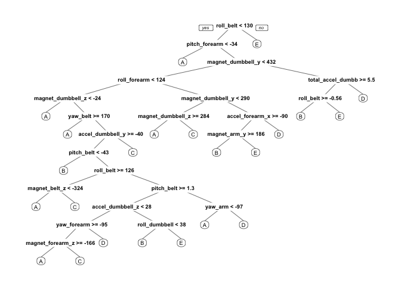

### Background

Many People collect data about the quantity of their exercise activity with devices such as Jawbone Up, Nike FuelBand, and Fitbit . This project investigates the possibility of using such data to quantify activity performance. The goal of this project is to predict performance quality using the "classe" variable in the training set.

### Accelerometer data

training data:

<https://d396qusza40orc.cloudfront.net/predmachlearn/pml-training.csv> test data:

<https://d396qusza40orc.cloudfront.net/predmachlearn/pml-testing.csv>

### Source and More information:

source: <http://groupware.les.inf.puc-rio.br/har>.

### Load and Clean Data

``` r
library(caret)
library(gridExtra)

training = read.csv("~/Desktop/PML/pml-training.csv",na.strings=c("NA","#DIV/0!",""))
testing  = read.csv("~/Desktop/PML/pml-testing.csv",na.strings=c("NA","#DIV/0!",""))

#c("NA","#DIV/0!","")replaces empty + Excel/error strings #DIV/0! by NAs. 
```

Remove columns with zero or near zero variance.. likely to have little predictive value.

``` r
zero.var<-nearZeroVar(training,saveMetrics  = TRUE)
training <- training[, !zero.var$nzv]
training<-training[,-(1:6)]
```

### investigate missing values

``` r
library(VIM)
library(plyr)
library(dplyr)

#library(mice)
#library(VIM)
aggr(training,prop=FALSE,numbers=TRUE)
```

 From the graph above (left) , we see that columns either have no or almost no missing values or most values missing.Further exploration below confirms 55% of columns have missing values and those 55% have an average 98% of values missing. This is dissapointing as it makes successful imputation optimistic , so the missing value columns will be removed.

``` r
na_count <-sapply(training, function(y) sum(length(which(is.na(y)))))

block.na<-na_count[na_count>0]
print("percentage of columns with any missing values")
```

    ## [1] "percentage of columns with any missing values"

``` r
round(length(block.na)/ncol(training),4)*100
```

    ## [1] 55.08

``` r
print("percentage of missing values  in columns with any missing values")
```

    ## [1] "percentage of missing values  in columns with any missing values"

``` r
round(mean(block.na)/nrow(training),4) *100
```

    ## [1] 98.01

``` r
#remove columns with missing values
training.no.na = colSums(is.na(training)) == 0
testing.no.na = colSums(is.na(testing)) == 0


training = training[, training.no.na]
testing = testing[, testing.no.na]
```

``` r
inTrain <- createDataPartition(y=training$classe, p=0.80, list=FALSE)
train1 <- training[inTrain, ] 
test1<- training[-inTrain, ]
```

Variable relationships with rpart
=================================

``` r
library(rpart)
library(rpart.plot)
modelTree <- rpart(classe ~ ., data = train1, method = "class")

prp(modelTree)
```

 We will look at some three different models and compare accuracy. Above rpart.plot gives an idea as to the relative importance of the different models.

### 1) Naive Bayes Model

``` r
library(e1071)

modnb <- train(classe~.,data=train1,method="nb",trControl=trainControl(method='cv',number=10),verbose=FALSE)
modnb
```

    ## Naive Bayes 
    ## 
    ## 15699 samples
    ##    52 predictor
    ##     5 classes: 'A', 'B', 'C', 'D', 'E' 
    ## 
    ## No pre-processing
    ## Resampling: Cross-Validated (10 fold) 
    ## Summary of sample sizes: 14131, 14129, 14129, 14129, 14128, 14128, ... 
    ## Resampling results across tuning parameters:
    ## 
    ##   usekernel  Accuracy   Kappa    
    ##   FALSE      0.5011746  0.3844854
    ##    TRUE      0.7448877  0.6737904
    ## 
    ## Tuning parameter 'fL' was held constant at a value of 0
    ## Tuning
    ##  parameter 'adjust' was held constant at a value of 1
    ## Accuracy was used to select the optimal model using  the largest value.
    ## The final values used for the model were fL = 0, usekernel = TRUE
    ##  and adjust = 1.

``` r
y=test1$classe
confusionMatrix(predict(modnb$finalModel,test1)$class, y)
```

    ## Confusion Matrix and Statistics
    ## 
    ##           Reference
    ## Prediction   A   B   C   D   E
    ##          A 999 173 168 140  45
    ##          B  25 487  47   2  81
    ##          C  32  63 439  80  24
    ##          D  56  32  29 396  32
    ##          E   4   4   1  25 539
    ## 
    ## Overall Statistics
    ##                                           
    ##                Accuracy : 0.729           
    ##                  95% CI : (0.7148, 0.7429)
    ##     No Information Rate : 0.2845          
    ##     P-Value [Acc > NIR] : < 2.2e-16       
    ##                                           
    ##                   Kappa : 0.6525          
    ##  Mcnemar's Test P-Value : < 2.2e-16       
    ## 
    ## Statistics by Class:
    ## 
    ##                      Class: A Class: B Class: C Class: D Class: E
    ## Sensitivity            0.8952   0.6416   0.6418   0.6159   0.7476
    ## Specificity            0.8126   0.9510   0.9386   0.9546   0.9894
    ## Pos Pred Value         0.6551   0.7586   0.6881   0.7266   0.9407
    ## Neg Pred Value         0.9512   0.9171   0.9254   0.9269   0.9457
    ## Prevalence             0.2845   0.1935   0.1744   0.1639   0.1838
    ## Detection Rate         0.2547   0.1241   0.1119   0.1009   0.1374
    ## Detection Prevalence   0.3887   0.1637   0.1626   0.1389   0.1461
    ## Balanced Accuracy      0.8539   0.7963   0.7902   0.7852   0.8685

### 2) Generalised Boosted Regression Model,using Trees

``` r
set.seed(333)
#Generalised boosted regression machine
modgbm <- train(classe ~ ., method = "gbm", data = train1, verbose = F, trControl = trainControl(method = "cv", number = 10))
```

``` r
predgbm <- predict(modgbm, test1)
confusionMatrix(predgbm, test1$classe)
```

    ## Confusion Matrix and Statistics
    ## 
    ##           Reference
    ## Prediction    A    B    C    D    E
    ##          A 1091   24    0    0    0
    ##          B   14  709   22    0    9
    ##          C   10   26  656   19    7
    ##          D    0    0    6  621   10
    ##          E    1    0    0    3  695
    ## 
    ## Overall Statistics
    ##                                          
    ##                Accuracy : 0.9615         
    ##                  95% CI : (0.955, 0.9673)
    ##     No Information Rate : 0.2845         
    ##     P-Value [Acc > NIR] : < 2.2e-16      
    ##                                          
    ##                   Kappa : 0.9513         
    ##  Mcnemar's Test P-Value : NA             
    ## 
    ## Statistics by Class:
    ## 
    ##                      Class: A Class: B Class: C Class: D Class: E
    ## Sensitivity            0.9776   0.9341   0.9591   0.9658   0.9639
    ## Specificity            0.9914   0.9858   0.9809   0.9951   0.9988
    ## Pos Pred Value         0.9785   0.9403   0.9136   0.9749   0.9943
    ## Neg Pred Value         0.9911   0.9842   0.9913   0.9933   0.9919
    ## Prevalence             0.2845   0.1935   0.1744   0.1639   0.1838
    ## Detection Rate         0.2781   0.1807   0.1672   0.1583   0.1772
    ## Detection Prevalence   0.2842   0.1922   0.1830   0.1624   0.1782
    ## Balanced Accuracy      0.9845   0.9600   0.9700   0.9805   0.9813

### 3) Random Forest Model

``` r
#creating predictive model using random forests
control <- trainControl(method="cv", 5)
modrf <- train(classe ~ ., data=train1, method="rf", trControl=control, ntree=250,verbose=FALSE)
modrf
```

    ## Random Forest 
    ## 
    ## 15699 samples
    ##    52 predictor
    ##     5 classes: 'A', 'B', 'C', 'D', 'E' 
    ## 
    ## No pre-processing
    ## Resampling: Cross-Validated (5 fold) 
    ## Summary of sample sizes: 12560, 12560, 12560, 12559, 12557 
    ## Resampling results across tuning parameters:
    ## 
    ##   mtry  Accuracy   Kappa    
    ##    2    0.9921646  0.9900886
    ##   27    0.9926104  0.9906529
    ##   52    0.9843290  0.9801734
    ## 
    ## Accuracy was used to select the optimal model using  the largest value.
    ## The final value used for the model was mtry = 27.

``` r
#prediction 

predrf <- predict(modrf, test1)


#comparison of the prediction and the test sub-dataset, with accuracy and OOSE values
table(predrf, test1$classe)
```

    ##       
    ## predrf    A    B    C    D    E
    ##      A 1115    8    0    0    0
    ##      B    1  750    4    0    1
    ##      C    0    1  679   10    2
    ##      D    0    0    1  633    1
    ##      E    0    0    0    0  717

``` r
confusionMatrix(predrf,test1$classe)
```

    ## Confusion Matrix and Statistics
    ## 
    ##           Reference
    ## Prediction    A    B    C    D    E
    ##          A 1115    8    0    0    0
    ##          B    1  750    4    0    1
    ##          C    0    1  679   10    2
    ##          D    0    0    1  633    1
    ##          E    0    0    0    0  717
    ## 
    ## Overall Statistics
    ##                                          
    ##                Accuracy : 0.9926         
    ##                  95% CI : (0.9894, 0.995)
    ##     No Information Rate : 0.2845         
    ##     P-Value [Acc > NIR] : < 2.2e-16      
    ##                                          
    ##                   Kappa : 0.9906         
    ##  Mcnemar's Test P-Value : NA             
    ## 
    ## Statistics by Class:
    ## 
    ##                      Class: A Class: B Class: C Class: D Class: E
    ## Sensitivity            0.9991   0.9881   0.9927   0.9844   0.9945
    ## Specificity            0.9971   0.9981   0.9960   0.9994   1.0000
    ## Pos Pred Value         0.9929   0.9921   0.9812   0.9969   1.0000
    ## Neg Pred Value         0.9996   0.9972   0.9985   0.9970   0.9988
    ## Prevalence             0.2845   0.1935   0.1744   0.1639   0.1838
    ## Detection Rate         0.2842   0.1912   0.1731   0.1614   0.1828
    ## Detection Prevalence   0.2863   0.1927   0.1764   0.1619   0.1828
    ## Balanced Accuracy      0.9981   0.9931   0.9943   0.9919   0.9972

### Selecting the Best model

We can see that accuracy for Naive Bayes, Generalised Boosted Regression and Random Forest models were 0.7397,0.9651 and 0.9944 respectively.In Fact, Random Forest outperforms the other variables on all measures. Calculating the out of sample error for this model gives 0.00056.

### Out of Sample Error

``` r
#Prediction Accuracy
accuracy <- postResample(predrf, test1$classe)
accuracy
```

    ##  Accuracy     Kappa 
    ## 0.9926077 0.9906474

``` r
plot(modrf)
```


``` r
#out-of-sample error
ose <- 1 - accuracy[[1]]
ose 
```

    ## [1] 0.007392302

### Applying Random Forest to predict class values for the testing Data Set.

``` r
result <- predict(modrf, testing)
result
```

    ##  [1] B A B A A E D B A A B C B A E E A B B B
    ## Levels: A B C D E
